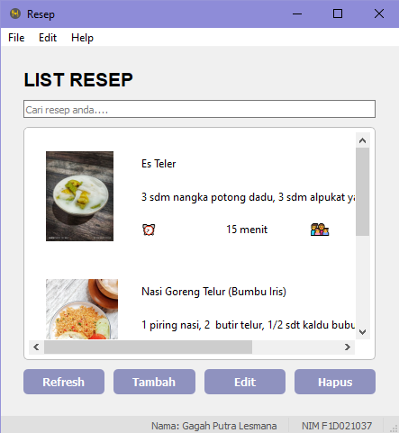
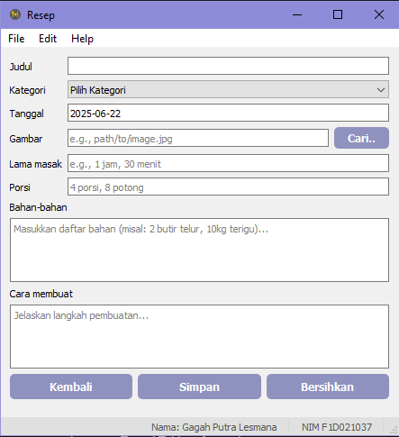
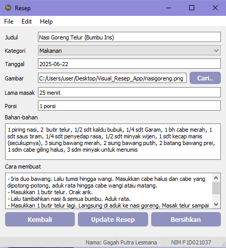
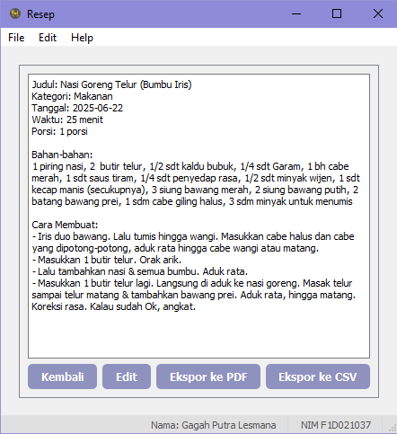

# APLIKASI RESEP

## Penjelasan aplikasi
Aplikasi Resep dikembangakan menggunakan PyQt5 sebagai antarmuka grafis dan SQLite sebagai sistem manajemen basis data. Aplikasi ini bertujuan untuk membantu pengguna dalam menyimpan, mengelola, dan meninjau resep makanan dengan mudah. Dalam aplikasi ini, pengguna dapat menambahkan resep lengkap beserta bahan, langkah pembuatan, gambar makanan, waktu memasak, dan porsi. Selain itu, aplikasi ini menyediakan fitur ekspor data ke format PDF dan CSV.

## Fitur utama pada aplikasi
* Menampilkan resep 
* Menambahkan resep
* Menghapus resep 
* Mengekspor resep

## Cuplikasn dari beberapa fungsi utama pada aplikasi
* Fungsi untuk memuat semua resep
```python
def load_resep_list(self):
    self.resep_list_widget.clear()
    reseps = self.db_manager.get_all_resep()...
```

* Fungsi untuk menyimpan resep
```python
def save_resep(self):
    ...
    if self.current_resep_id is None: #Memerikasa apakah resep sudah ada
      if self.db_manager.add_resep(judul, kategori, bahan, cara, tanggal, gambar_path, waktu, porsi):
        QMessageBox.information(self, "Sukses", "Resep berhasil ditambahkan!")
        self.load_resep_list()
        self.clear_detail_panel()
        self.show_list_page()...
```

* Fungsi untuk menghapus resep
```python
def delete_resep(self):
    ...
    if confirm == QMessageBox.Yes:
        if self.db_manager.delete_resep(resep_id):
            QMessageBox.information(self, "Berhasil", f"Resep '{judul}' berhasil dihapus.")
            self.load_resep_list()
            self.clear_detail_panel()
            self.show_list_page()...
```

* Fungsi untuk mengekspor resep ke PDF
```python
def export_to_pdf(parent, resep_data):
    file_name, _ = QFileDialog.getSaveFileName(parent, "Ekspor Resep ke PDF", "", "PDF Files (*.pdf)")
    if not file_name:
        return...
```

* Fungsi untuk mengekspor resep ke CSV
```python
def export_to_csv(parent, resep_data):
    file_name, _ = QFileDialog.getSaveFileName(parent, "Ekspor Resep ke CSV", "", "CSV Files (*.csv)")
    if not file_name:
        return...
```

* Fungsi untuk menampilkan tampilan ringkas dari resep
```python
def show_resep_view(self, resep_id):
    resep_data = self.db_manager.get_resep_detail(resep_id)
    if not resep_data:
        QMessageBox.warning(self, "Kesalahan", "Resep tidak ditemukan.")
        return...
```

## Beberapa hasil screnshoot dari aplikasi




